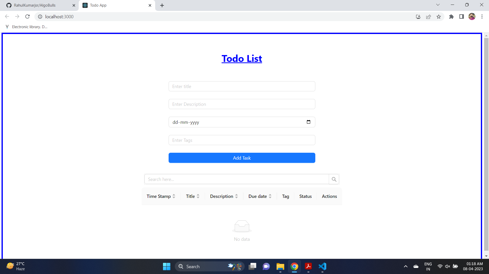
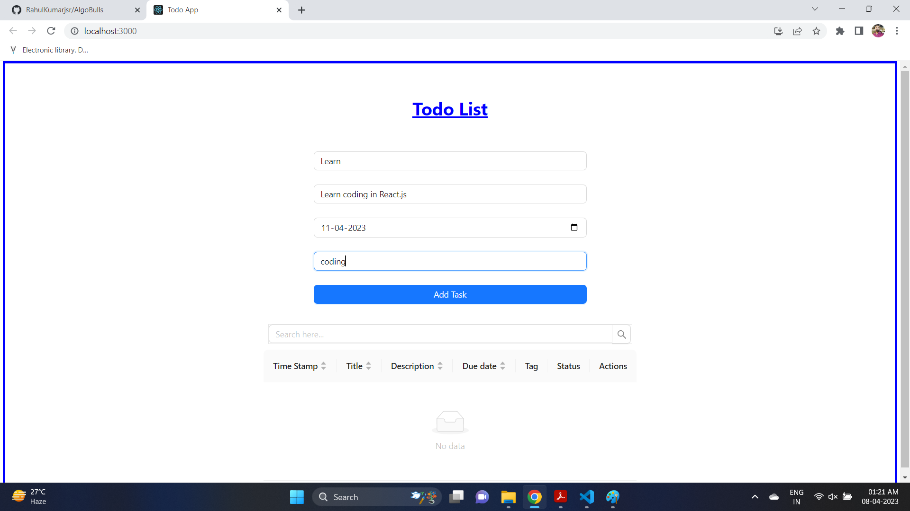
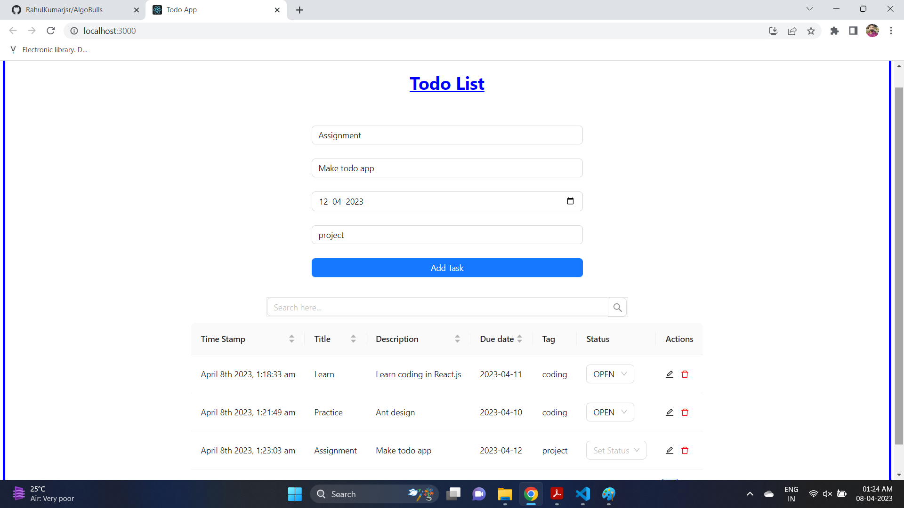
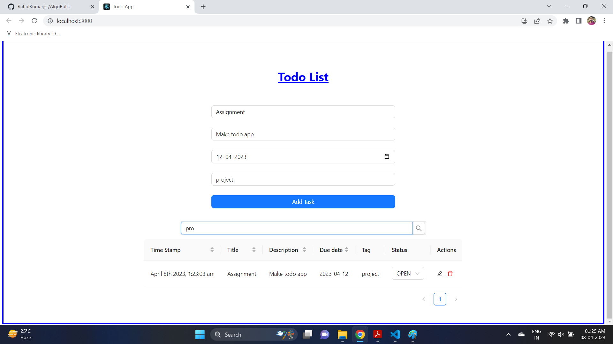
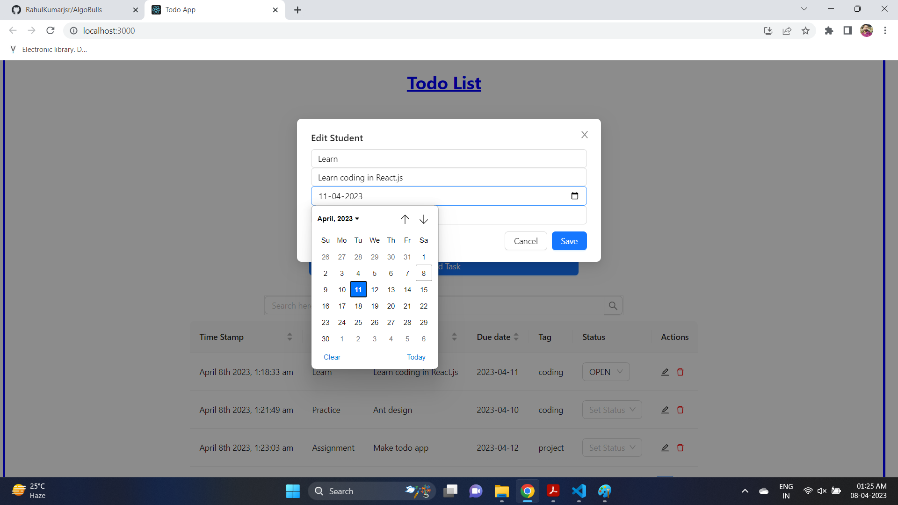
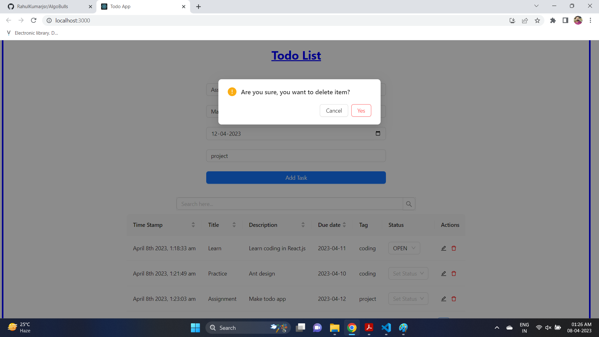

Link to the Todo App => https://mytodoassistant.netlify.app/

In this Todo App, the user can enter the title of task along with description, due date, tags and once the user clicks the button the task is added in a form of row in the todo task table. The time of the creation of task is added as timestamp in the first column.
Once the task is added, the user can change the status of the task, and if any changes is to be made then that can be done by clicking the edit icon in the last column. 
The task can be deleted by clicking the delete icon in the last column.
The user can sort the tasks according to their preferences and a search bar is provided so that the user can search the particular task with the keyword.

